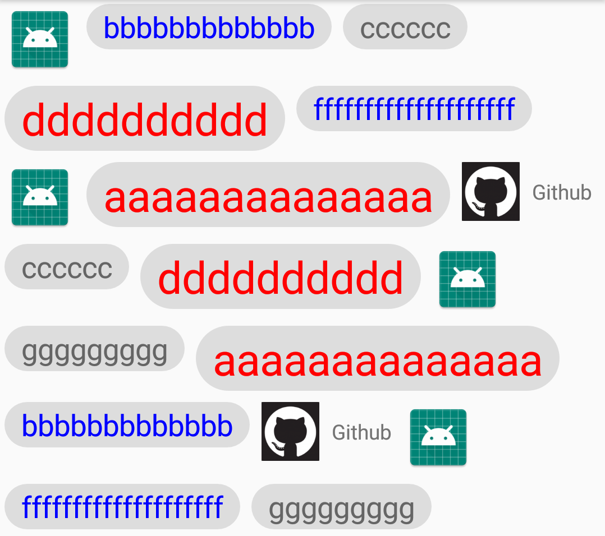
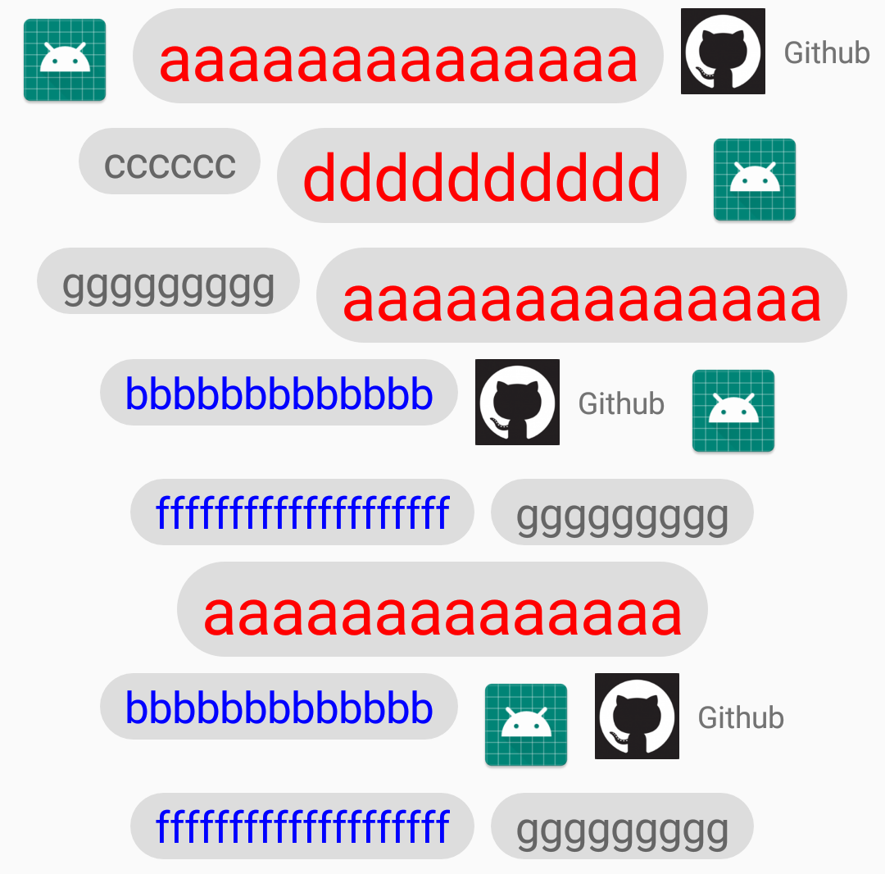

# XFlowLayout
Android流式布局，支持限制最大行数，每行内容居中显示

## 特点
- 支持设置最大显示行数

- 支持定制每行内容居中显示

- 支持一行里的view高度不一致  行高按照最高的view的高度，其他view靠上显示

- item内容定制自由

## 效果图



## gradle
```
implementation 'com.xugter:xflowlayout:1.0.1'
```

## 使用步骤
1. XML
```
<com.xugter.xflowlayout.XFlowLayout
    android:id="@+id/flow_layout"
    android:layout_width="match_parent"
    android:layout_height="wrap_content" />
```

2. 设置Adapter

```
xFlowLayout.setAdapter(new XFlowLayout.Adapter() {
...
});
```

- **getItemCount** 
获取item的数量
- **getItemViewByPos**
根据位置获取相应的view
- **notifyDataChanged**
更新数据

### 设置最大行数
- **Java**
```
setMaxLine(3)
```
- **XML**
```
app:max_line="3"
```

### 设置居中显示
- **Java**
```
setCenterHorizontal(true)
````
- **XML**
```
app:center_horizontal="true"
```
